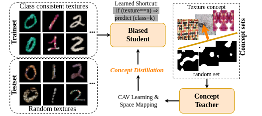
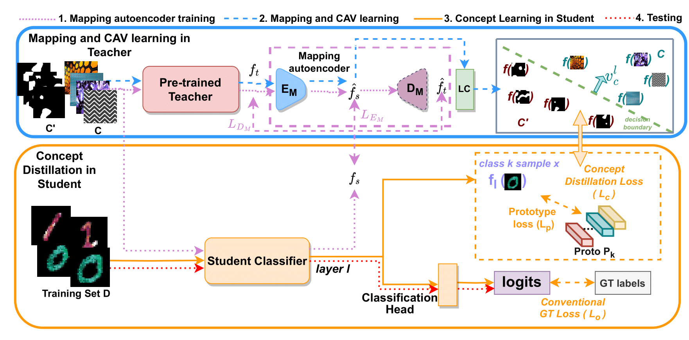

## Concept Distillation 
Code for our paper titled "Concept Distillation: Leveraging Human-Centered Explanations for Model Improvement​" accepted at Neurips, 2023.

## Abstract
Humans use abstract *concepts* for understanding instead of hard features. Recent interpretability research has focused on human-centered concept explanations of neural networks. Concept Activation Vectors (CAVs) estimate a model's sensitivity and possible biases to a given concept. In this paper, we extend CAVs from post-hoc analysis to ante-hoc training in order to reduce model bias through fine-tuning using an additional *Concept Loss*. Concepts were defined on the final layer of the network in the past. We generalize it to intermediate layers using class prototypes. This facilitates class learning in the last convolution layer which is known to be most informative. We also introduce *Concept Distillation* to create richer concepts using a pre-trained knowledgeable model as the teacher. Our method can sensitize or desensitize a model towards concepts. We show applications of concept-sensitive training to debias several classification problems. We also use concepts to induce prior knowledge into IID, a reconstruction problem. Concept-sensitive training can improve model interpretability, reduce biases, and induce prior knowledge. P




[Website](https://avani17101.github.io/Concept-Distilllation/) | [Neurips Link](https://neurips.cc/virtual/2023/poster/71179) 

## Method


Our framework comprises a concept teacher and a student classifier and has the following four steps: 
1) Mapping teacher space to student space for concepts $C$ and $C'$ by training an autoencoder $E_M$ and $D_M$ (dotted purple lines).
2) CAV $v^l_c$ learning in mapped teacher space via a linear classifier LC (dashed blue lines). 
3) Training the student model with Concept Distillation (solid orange lines): We use $v^l_c$ and class prototypes loss $L_p$ to define our concept distillation loss $L_c$ and use it with the original training loss $L_o$ to (de)sensitize the model for concept $C$.
4) Testing where the trained model is applied (dotted red lines).

## Inputs
 * We need user provided concepts sets, train, eval and test datasets and a model to be trained as inputs.

## Instructions to run the Code
* Install requirements by 
```
conda env create -f environment.yml
or 
pip install -r requirements.txt
```
* For replicating our results on MNIST, we provide data creation scripts in src/mnist.
* We have concept sets in concepts folder.
* Do the four mentioned steps for Concept Distillation.
    Check scripts/run_all_components.sh for details.

* We provide an additional script CD_modular.py for you to customize according to dataset, models and task at hand (with user given concept sets)

## TODOs
* Clean codebase.
* Add concept examples for example code run.


## Acknowledgements
* We referred codebase by [official-tcav](https://github.com/tensorflow/tcav) which is written in tensorflow and [pytorch-tcav](https://github.com/rakhimovv/tcav) written in pytorch for TCAV implementation.
* We use DINO feature extractor from [Dino](https://github.com/dichotomies/N3F) and download DINO checkpoints from [Official DINO repository](https://github.com/facebookresearch/dino)
* For a local loss and mnist datasets, we use [CDEP implementation](https://github.com/laura-rieger/deep-explanation-penalization/tree/master).


Shield: [![CC BY-NC-SA 4.0][cc-by-nc-sa-shield]][cc-by-nc-sa]

This work is licensed under a
[Creative Commons Attribution-NonCommercial-ShareAlike 4.0 International License][cc-by-nc-sa].

[![CC BY-NC-SA 4.0][cc-by-nc-sa-image]][cc-by-nc-sa]

[cc-by-nc-sa]: http://creativecommons.org/licenses/by-nc-sa/4.0/
[cc-by-nc-sa-image]: https://licensebuttons.net/l/by-nc-sa/4.0/88x31.png
[cc-by-nc-sa-shield]: https://img.shields.io/badge/License-CC%20BY--NC--SA%204.0-lightgrey.svg


